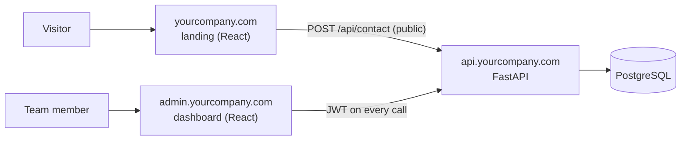
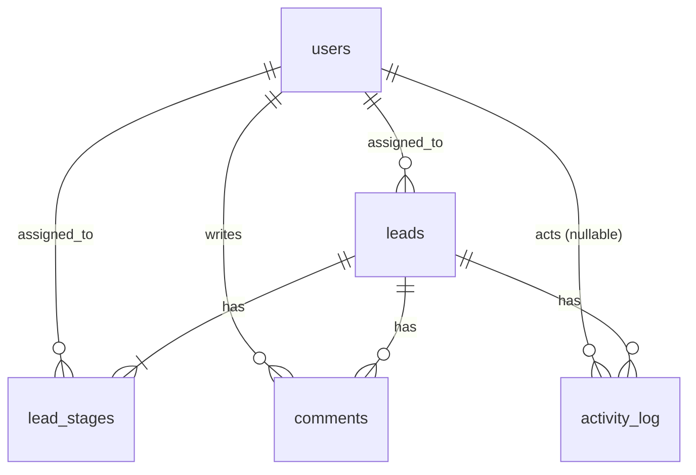

# Architecture

## System overview

Two separate React frontends talk to one FastAPI backend. The landing bundle contains no dashboard code.



| Part | Responsibility |
| --- | --- |
| Landing | Contact form only. Talks to one public endpoint. |
| Admin | Current requests (leads) and activity logs. Login required. |
| API (this repo) | Validation, business rules, auth, persistence. The real security boundary. |

## Request flows

**Public contact submission**

```mermaid
sequenceDiagram
    Visitor->>API: POST /api/contact
    API->>API: rate limit per IP, validate, strip HTML
    alt honeypot filled
        API-->>Visitor: 201 (fake success, nothing stored)
    else valid
        API->>DB: BEGIN; insert lead + 3 pending stages + lead_created log; COMMIT
        API-->>Visitor: 201
    end
```

**Team login**: `POST /auth/login` (rate limited) verifies the argon2 hash and the `is_active` flag, returns a short-lived JWT. Every later call sends `Authorization: Bearer <token>`; `get_current_user` decodes it and reloads the user, rejecting inactive or missing users, so deactivation takes effect immediately.

**Stage status update**

```mermaid
sequenceDiagram
    Admin->>API: PATCH /api/leads/{id}/stages/{stage} {status}
    API->>API: get_current_user (401 if invalid)
    API->>DB: update stage; log_activity() in the same transaction; COMMIT
    API-->>Admin: lead (with derived status) + warnings[]
```

## Data model



Tables: `users`, `leads`, `lead_stages` (unique per `lead_id`+`stage`), `comments` (`stage` null = general), `activity_log` (append-only; `user_id` null = system/public action). Columns are defined in `app/models/`.

**Overall status is derived, not stored.** A stored status would duplicate information already held by the three stages and could drift out of sync. It is computed by `derive_status()` in `app/services/leads.py`: all pending → `pending`; all completed → `completed`; otherwise `in_progress`. List filtering loads stage statuses with the leads and filters in Python, which is fine at this volume.

## API endpoints

| Method | Path | Auth | Purpose |
| --- | --- | --- | --- |
| POST | `/api/contact` | public, rate-limited | Submit the contact form |
| GET | `/health` | public | Liveness check |
| POST | `/auth/login` | public, rate-limited | Exchange email + password for a JWT |
| GET | `/auth/me` | JWT | Current user |
| POST | `/auth/change-password` | JWT | Body `{current_password, new_password}` |
| GET | `/api/leads` | JWT | List; `status`, `q`, `page`, `page_size`; newest first |
| GET | `/api/leads/{id}` | JWT | Lead + stages + comments + its activity |
| PATCH | `/api/leads/{id}` | JWT | Body `{assigned_to}` (null unassigns) |
| PATCH | `/api/leads/{id}/stages/{stage}` | JWT | Body `{status?, assigned_to?}`; response includes `warnings` |
| POST | `/api/leads/{id}/comments` | JWT | Body `{body, stage?}` |
| GET | `/api/users` | JWT | Active team members (`id`, `name`) for assignee dropdowns |
| GET | `/api/activity` | JWT | Global or per-lead feed; `lead_id`, `user_id`, `limit`, `before` (cursor = entry id) |

`/auth/login` must be reachable without a token, so it is the one public route beyond the two the spec names. A test enumerates every route and asserts 401 without a token on everything not in the explicit public list, so a newly added route is protected by default and the test fails if it is not.

## Auth and security model

- **JWT** (HS256, `JWT_EXPIRE_MINUTES`, default 60) with a server-side secret. No refresh tokens.
- **Passwords** hashed with argon2, minimum 12 characters. Login does the same work for unknown emails to avoid timing leaks, and returns one generic error.
- **Team accounts only.** There is no signup route; accounts are created, reset and deactivated through `scripts/manage_users.py`, run inside the deployed environment. Users are never deleted. No roles, no email reset.
- **What protects the dashboard:** the backend (JWT on all team endpoints, no signup, rate-limited login), not URL secrecy. Optionally add Cloudflare Access in front of `admin.` later.
- **CORS** is limited to `CORS_ORIGINS`. It only restricts browsers; it is not authentication.
- **Rate limiting** (SlowAPI, per IP): `POST /api/contact` 5/hour, `POST /auth/login` 10/minute. Limits are in-memory per process, which suits a single instance at launch.
- **Honeypot:** the hidden `website` field. If filled, the API returns a normal 201 and stores nothing.
- **Input handling:** HTML tags stripped, lengths enforced, email validated, `consent` must be true (stored per lead for DPDP compliance).
- **Headers:** HSTS, `X-Content-Type-Options`, `X-Frame-Options`, `Referrer-Policy`, `Cache-Control: no-store`. API docs are disabled when `ENV=prod`.

## Activity logging

All writes to `activity_log` go through `log_activity(session, lead_id, user_id, action, stage, old, new, *, message)` in `app/services/activity.py`.

- It adds the row to the caller's session without committing, so the log entry and the change it describes commit or roll back together (the **same-transaction rule**). Routes commit once at the end.
- `message` is a ready-to-render sentence, e.g. `Soumava moved Backend: pending → in progress`, so the UI just displays it.
- Actions: `lead_created`, `stage_status_changed`, `lead_assigned`, `stage_assigned`, `comment_added`. Unknown actions raise.
- The table is append-only: there are no update/delete routes and the ORM refuses to update or delete rows.
- Changes that do nothing (same status, same assignee) are not logged.
- Team-account changes are logged to the application log (`app.audit`), not here, because this table is lead-scoped.

## Deployment

```
yourcompany.com        → landing (Vercel/Netlify)
admin.yourcompany.com  → dashboard (Vercel/Netlify, noindex + Disallow: /)
api.yourcompany.com    → FastAPI + managed Postgres (Render/Railway/Fly.io)
```

The start command is `alembic upgrade head && uvicorn app.main:app --host 0.0.0.0 --port $PORT --proxy-headers` (run a single worker: the rate limiter is in-memory). Environments are selected with `ENV` (`dev`, `staging`, `prod`); non-dev refuses weak configuration at startup.

| Variable | Purpose |
| --- | --- |
| `DATABASE_URL` | Database connection (`postgres://` URLs from hosts are normalised to psycopg) |
| `JWT_SECRET` | JWT signing key (32+ chars outside dev) |
| `JWT_EXPIRE_MINUTES` | Token lifetime |
| `CORS_ORIGINS` | Comma-separated landing + admin origins |
| `ENV` | `dev` / `staging` / `prod` |
| `CONTACT_RATE_LIMIT`, `LOGIN_RATE_LIMIT` | Optional rate-limit overrides |

## Key decisions and trade-offs

- **Strings, not DB enums,** for `business_type`, `stage` and `status`: validated in Pydantic so changing the lists needs no migration.
- **Stage order is not enforced.** Out-of-order changes succeed and return a `warnings` array, because real work does not always go in order.
- **Duplicate email is flagged, not blocked** (`duplicate_email` on lead responses and a note in the `lead_created` message).
- **No email at all.** The dashboard is the only notification channel.
- **No roles.** Every team member can do everything.
- **Stage assumption:** the three stages apply per lead. If they should describe our own product build, replace `leads` with `projects` and keep the same stage/activity design.
- **Custom JWT auth** rather than Clerk/Auth0, to keep launch simple. Revisit if the team grows.
- **Out of scope:** email, self-service signup, email password reset, roles, CSV export, Slack/Discord alerts, tags, editing/deleting comments, analytics, Redis/Celery, CRM sync.

## How to extend

- **New endpoint:** add a route in `app/api/routes/`, put business logic in `app/services/`, schemas in `app/schemas/`, and include the router in `app/main.py`. Team routes must depend on `get_current_user`. The 401 test picks the route up automatically.
- **New stage:** add it to `STAGES` in `app/core/constants.py` (order matters), create lead stage rows for existing leads in a data migration, and update the frontend. Status derivation and warnings adapt automatically.
- **New business type:** add it to `BUSINESS_TYPES` in `app/core/constants.py` and to the landing form. No migration needed.
- **New activity action:** add a constant to `ACTIONS` and call `log_activity()` from the mutation, inside its transaction.
- **Schema change:** edit the model, run `alembic revision --autogenerate`, review the file, and update this document.
